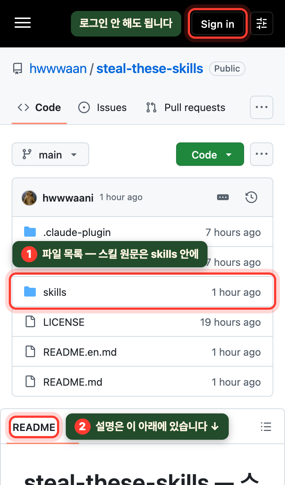
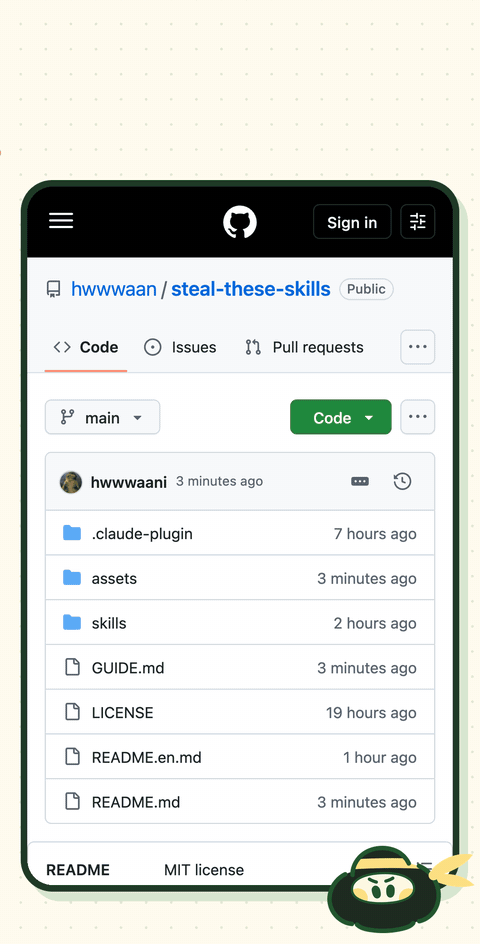
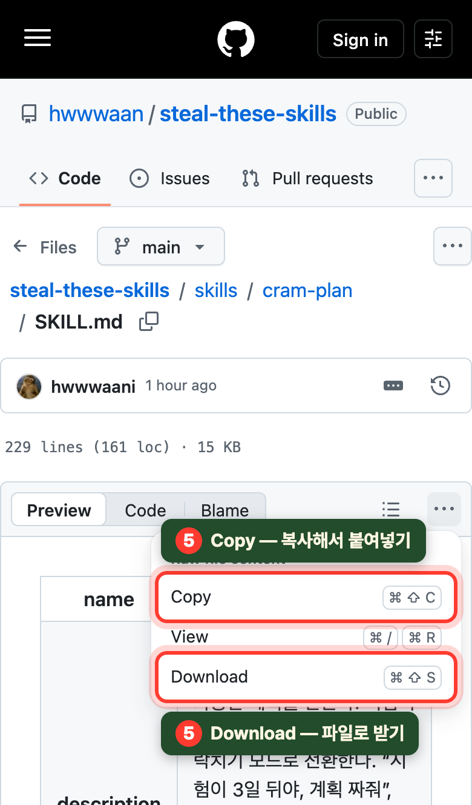
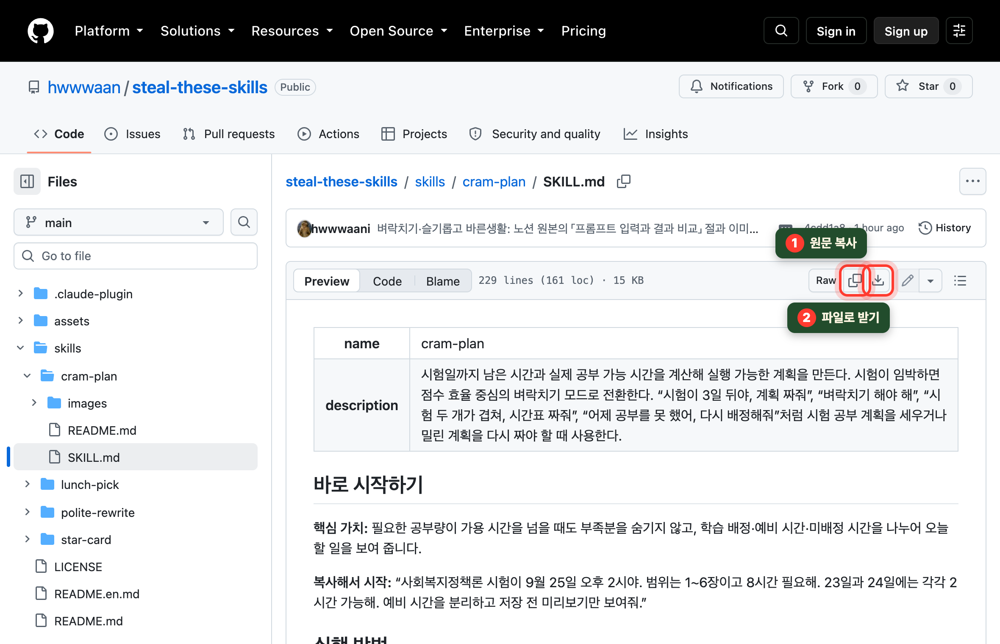
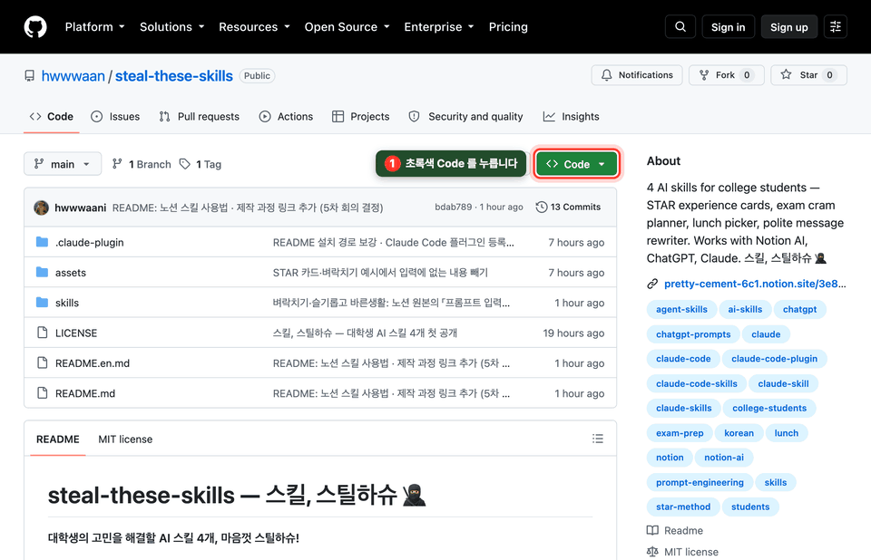

# 깃허브가 처음이라면 🐣

**3분이면 됩니다. 가입도 로그인도 필요 없습니다.**

깃허브는 파일을 올려두는 공개 폴더라고 생각하면 됩니다. 버튼이 영어라 낯설 뿐이고,
여기서 할 일은 **스킬 파일을 복사하거나 받는 것** 하나입니다.
구경하는 사람은 아무것도 바꿀 수 없으니 마음 놓고 눌러보세요.

## 먼저 — 깃허브에서 받을 게 있는지부터 보세요

| 어디서 쓸 건가요 | 깃허브에서 할 일 |
|---|---|
| **노션 AI** | **없습니다.** [노션 템플릿](https://pretty-cement-6c1.notion.site/3e84605a116d8055973edf4fdb40aa86)을 열고 **복제**만 누르면 됩니다 |
| **ChatGPT · Claude 프로젝트** | 스킬 파일(`SKILL.md`)을 복사하거나 받습니다 → [2번](#2-스킬-하나만-가져가기--폰에서) |
| **Claude 웹·앱에 스킬로 등록** | ZIP을 받습니다 → [4번](#4-claude에-올릴-zip은-링크만-누르면-됩니다) |

## 1. 처음 열면 이렇게 보입니다

- 맨 위에 보이는 것은 **파일 목록**입니다. 설명글은 그 **아래**에 있으니 화면을 내리세요
- `Sign in` 은 누르지 않아도 됩니다. 로그인 없이 전부 보이고 전부 받아집니다

버튼 이름은 이 정도만 알면 됩니다.

| 화면에 보이는 말 | 뜻 |
|---|---|
| `Code` | 파일 보기 · 받기 |
| `Download` | 파일로 받기 |
| `Copy` | 내용 복사 |
| `Raw` | 꾸밈 없는 원문 그대로 보기 |
| `README` | 이 저장소 설명글 |

## 2. 스킬 하나만 가져가기 — 폰에서

1. 파일 목록에서 **`skills`** 를 누릅니다
2. 쓰고 싶은 스킬 폴더를 고릅니다

   | 폴더 이름 | 스킬 |
   |---|---|
   | `star-card` | 🧱 경험 정리 — STAR 카드 |
   | `cram-plan` | ⚡ 벼락치기 |
   | `lunch-pick` | 🍽️ 오늘 점심 뭐먹지? — 점메추 |
   | `polite-rewrite` | 💬 슬기롭고 바른생활 |

3. **`SKILL.md`** 를 누릅니다. 이 파일이 스킬 본문입니다
4. 오른쪽의 **`···`** 을 누릅니다
5. **`Copy`** 를 누르면 전체가 복사되고, **`Download`** 를 누르면 파일로 받아집니다

복사했다면 ChatGPT나 Claude 대화창에 붙여넣고 그 아래에 고민을 적으면 바로 쓸 수 있습니다.

## 3. PC에서

스킬 파일을 열면 오른쪽 위에 버튼이 바로 보입니다.

네 개를 한 번에 받고 싶다면 첫 화면에서 초록색 **`Code`** → **`Download ZIP`** 을 누릅니다.

받은 ZIP을 풀면 `skills` 폴더 안에 스킬 네 개가 들어 있습니다.

## 4. Claude에 올릴 ZIP은 링크만 누르면 됩니다

깃허브 화면을 찾아다닐 필요 없이 아래 링크를 누르면 바로 받아집니다.

[star-card.zip](https://github.com/hwwwaan/steal-these-skills/releases/latest/download/star-card.zip) ·
[cram-plan.zip](https://github.com/hwwwaan/steal-these-skills/releases/latest/download/cram-plan.zip) ·
[lunch-pick.zip](https://github.com/hwwwaan/steal-these-skills/releases/latest/download/lunch-pick.zip) ·
[polite-rewrite.zip](https://github.com/hwwwaan/steal-these-skills/releases/latest/download/polite-rewrite.zip)

## 5. 받은 다음에는

노션 AI · Claude · ChatGPT에 넣는 방법은 **[스킬 사용법](https://pretty-cement-6c1.notion.site/3e94605a116d800fa5f4f759d687e422)** 에 그림과 함께 정리해 두었습니다.

## 자주 묻는 것

**로그인하라는 창이 떠요.**
닫으면 됩니다. 보고 받는 데에는 계정이 필요 없습니다.

**잘못 눌러서 뭔가 망가뜨리면 어떡하죠?**
그럴 일은 없습니다. 구경하는 사람은 파일을 고치거나 지울 수 없습니다.

**`SKILL.md` 를 받았는데 어떻게 여나요?**
글자만 든 파일이라 메모장이나 텍스트 편집기로 열립니다. 열어보지 않고 그대로 ChatGPT·Claude에 올려도 됩니다.

**길을 잃었어요.**
화면 위쪽의 **`steal-these-skills`** 글자를 누르면 첫 화면으로 돌아옵니다.

---

[← 처음 화면으로](README.md)
