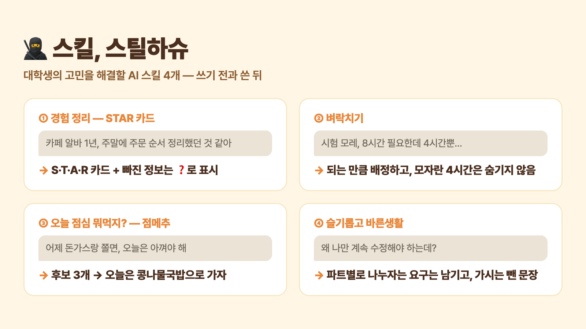

# steal-these-skills — 스킬, 스틸하슈 🥷

**대학생의 고민을 해결할 AI 스킬 4개, 마음껏 스틸하슈!**

경험 정리, 시험 벼락치기, 점심 메뉴, 감정 섞인 카톡까지 — 대학생이 매일 부딪히는 고민을
AI 스킬로 만들어 뒀습니다. 가져가서 쓰세요. 그러라고 만들었습니다.

노션 AI · Claude · ChatGPT · Codex · Cursor 어디서든 쓸 수 있습니다. [English](README.en.md)

> **📥 가져가기**
>
> - **노션 AI** → [노션 템플릿](https://pretty-cement-6c1.notion.site/3e84605a116d8055973edf4fdb40aa86)에서 **복제**를 누르면 스킬 4개가 한 번에 들어옵니다
> - **Claude 웹·앱** → [스킬 ZIP](#claude-웹앱에서)을 받아 **Customize → Skills** 에 올립니다
> - **Claude Code · Codex · Cursor** → `npx skills add hwwwaan/steal-these-skills`
> - **ChatGPT · Claude 프로젝트** → [`skills/`](skills/) 에서 `SKILL.md` 를 받아 프로젝트 파일에 올립니다
>
> 깃허브 계정이 없어도 됩니다. 로그인 없이 전부 받아집니다.



## 스킬 4개

| | 스킬 | 이런 걸 해줘요 | 만든 사람 |
|---|---|---|---|
| 🧱 | [① 경험 정리 — STAR 카드](skills/star-card/) | 동아리·알바·조별과제 경험을 자소서에 다시 꺼내 쓸 수 있는 STAR 카드로 정리 | 파도 |
| ⚡ | [② 벼락치기](skills/cram-plan/) | 시험까지 남은 시간과 범위로 **실제로 되는** 공부 계획표를 짜줌 | 다운 |
| 🍽️ | [③ 오늘 점심 뭐먹지? — 점메추](skills/lunch-pick/) | 어제 먹은 것과 오늘 지갑 사정을 보고 메뉴를 **딱 하나** 골라줌 | 파도 |
| 💬 | [④ 슬기롭고 바른생활](skills/polite-rewrite/) | 욱해서 쓴 말을 실제로 보낼 수 있는 문장으로 바꿔줌 — 할 말은 남기고 | 다운 |

<!--
  ⛔ 「우리가 먼저 써봤습니다」 — 팀원이 직접 쓴 장면만 넣는다. 에이전트가 지어내지 않는다.
  네 줄이 다 채워지면 이 주석을 풀어 「스킬 4개」 절 바로 아래에 둔다.

## 우리가 먼저 써봤습니다

- **경험 정리 STAR 카드** — 〔파도: 이 스킬을 실제로 쓴 장면 한 줄〕
- **벼락치기** — 〔다운: 이 스킬을 실제로 쓴 장면 한 줄〕
- **오늘 점심 뭐먹지?** — 〔파도: 이 스킬을 실제로 쓴 장면 한 줄〕
- **슬기롭고 바른생활** — 〔다운: 이 스킬을 실제로 쓴 장면 한 줄〕
-->

## 네 스킬의 공통점 — 안 하는 일을 적어뒀습니다

AI한테 일을 시킬 때 제일 안 풀리는 게 **범위를 안 정해주는 것**입니다.
그래서 네 스킬 모두 「무엇을 한다」만큼 **「무엇은 안 한다」**를 본문에 박아뒀습니다.

- **경험 정리 STAR 카드** — 자소서 완성문을 쓰지 않습니다. 경험을 구조화하는 데까지만 합니다
- **벼락치기** — 모자란 시간을 숨기지 않습니다. 부족하면 부족하다고 씁니다
- **오늘 점심 뭐먹지?** — 식당이나 가격을 찾지 않습니다. 오늘 먹을 메뉴만 정합니다
- **슬기롭고 바른생활** — 원문에 없는 기한·사과·약속을 지어내지 않습니다

각 `SKILL.md`에서 **「금지 사항」**(슬기롭고 바른생활은 「필수 원칙」, 벼락치기는 「핵심 계획 규칙」)부터 보시면
이 스킬이 나한테 맞는지 30초면 판단이 섭니다.

## 이렇게 말해보세요

```
카페 아르바이트 경험을 STAR로 정리해줘.
사회복지정책론 시험이 3일 뒤야. 범위는 1~6장이고 오늘 4시간 가능해.
어제 돈가스 먹었어. 오늘은 저렴하게 먹고 싶어.
팀플 단톡방에 보낼 수 있게 바꿔줘: 왜 나만 계속 수정해야 하는데?
```

## 쓰는 법

### 노션 AI에서

1. [노션 템플릿](https://pretty-cement-6c1.notion.site/3e84605a116d8055973edf4fdb40aa86)을 열고 오른쪽 위 **복제**를 눌러 내 워크스페이스로 가져옵니다 — 스킬 4개가 한 번에 들어옵니다
2. 페이지 오른쪽 위 `···` → **AI로 사용** → **AI 기술로 사용**을 누릅니다
3. 노션 AI 채팅에서 `/`를 눌러 스킬을 고르고, 고민을 평소 말하듯 적으면 됩니다

### Claude 웹·앱에서

1. 쓰고 싶은 스킬의 ZIP을 받습니다 —
   [star-card.zip](https://github.com/hwwwaan/steal-these-skills/releases/latest/download/star-card.zip) ·
   [cram-plan.zip](https://github.com/hwwwaan/steal-these-skills/releases/latest/download/cram-plan.zip) ·
   [lunch-pick.zip](https://github.com/hwwwaan/steal-these-skills/releases/latest/download/lunch-pick.zip) ·
   [polite-rewrite.zip](https://github.com/hwwwaan/steal-these-skills/releases/latest/download/polite-rewrite.zip)
2. [claude.ai](https://claude.ai/customize/skills)에서 **Customize → Skills** → **+** → **Create skill** → **Upload a skill** 을 누르고 받은 ZIP을 그대로 올립니다
3. 그다음부터는 채팅에 고민만 적으면 알맞은 스킬이 알아서 켜집니다

사파리에서 받으면 ZIP이 저절로 풀릴 수 있습니다. 그때는 풀린 폴더를 다시 압축해서 올리면 됩니다.

### Claude Code · Codex · Cursor · Gemini CLI에서

```bash
npx skills add hwwwaan/steal-these-skills
```

하나만 받고 싶으면 `--skill` 뒤에 이름을 붙입니다 — `star-card` · `cram-plan` · `lunch-pick` · `polite-rewrite`

```bash
npx skills add hwwwaan/steal-these-skills --skill cram-plan
```

Claude Code에서는 플러그인으로도 받을 수 있습니다.

```
/plugin marketplace add hwwwaan/steal-these-skills
/plugin install steal-these-skills@shoocream
```

<details>
<summary>npx 없이 직접 넣고 싶다면</summary>

```bash
git clone https://github.com/hwwwaan/steal-these-skills.git
cp -r steal-these-skills/skills/* ~/.claude/skills/
```

</details>

### ChatGPT · Claude 프로젝트에서

1. 쓰고 싶은 스킬 폴더의 `SKILL.md`를 받습니다
2. 프로젝트 파일에 올리고, 프로젝트 지침에 「이 스킬 파일의 규칙을 따라줘」라고 적어둡니다
3. 그다음부터는 스킬 원문을 붙여넣을 필요 없이 고민만 적으면 됩니다

### 깃허브 계정이 없어도 됩니다

이 페이지 위쪽 초록색 **`Code`** 버튼 → **`Download ZIP`** 을 누르면 로그인 없이 전부 받아집니다.

## 만든 사람들

**슈크림마을**의 **파도**와 **다운**이 만들었습니다.
만든 과정이 궁금하면 슈크림마을 카카오톡 플러스친구에서 받아보세요.

<!-- TODO(사람이 채움): 슈크림마을 한 줄 소개 · 인스타그램 링크 · 카카오톡 플러스친구 링크 -->

## 업데이트

<!-- 두 번째 물결(10/1 전후 v1.1)을 낼 때 여기에 한 줄 얹고 깃허브 릴리스도 같이 만든다. 예정은 적지 않는다. -->

- **v1.0** (2026-09-28) — 스킬 4개 공개

새 스킬은 여기와 [릴리스](https://github.com/hwwwaan/steal-these-skills/releases)에 올립니다.
소식을 받으려면 오른쪽 위 **Watch → Custom → Releases** 를 켜 두세요. 쓸 만했다면 **⭐ Star** 도 눌러주시면 힘이 됩니다.

## 라이선스

[MIT](LICENSE) — 마음껏 가져가서 고치고 나눠도 됩니다. 출처만 남겨주세요.
