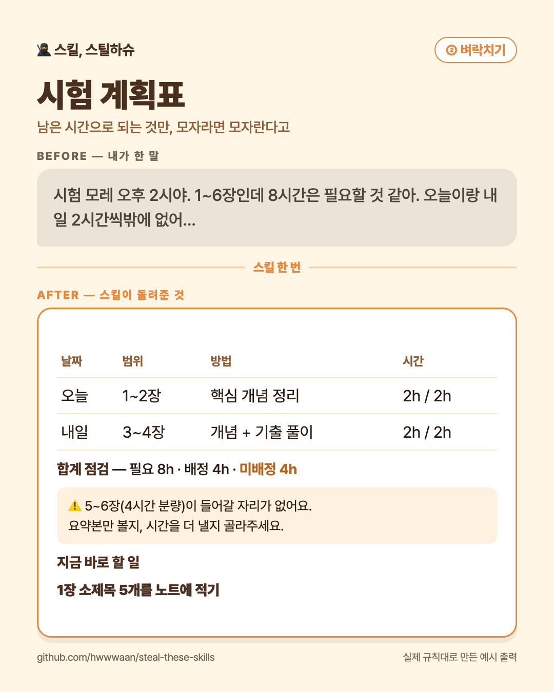

# ⚡ ② 벼락치기

**남은 시간에 맞춰 실행 가능한 시험공부 계획을 만드는 스킬**

시험 범위와 실제 공부 가능한 시간을 계산해 우선순위와 공부 순서를 정리해요.

## 이렇게 말해보세요

- “사회복지정책론 시험이 3일 뒤야. 범위는 1~6장이고 오늘 4시간 가능해.”
- “내일 오전 10시 경제학 시험이야. 2장까지만 봤고 기출 중심으로 짜줘.”
- “완료하지 못한 공부만 오늘 이후로 다시 배정해줘.”

## 쓰는 법

스킬 본문은 [`SKILL.md`](SKILL.md) 입니다. 설치는 [루트 README의 「쓰는 법」](../../README.md#쓰는-법)을 보세요.

---

만든 사람: **다운** · 슈크림마을 「스킬, 스틸하슈」
