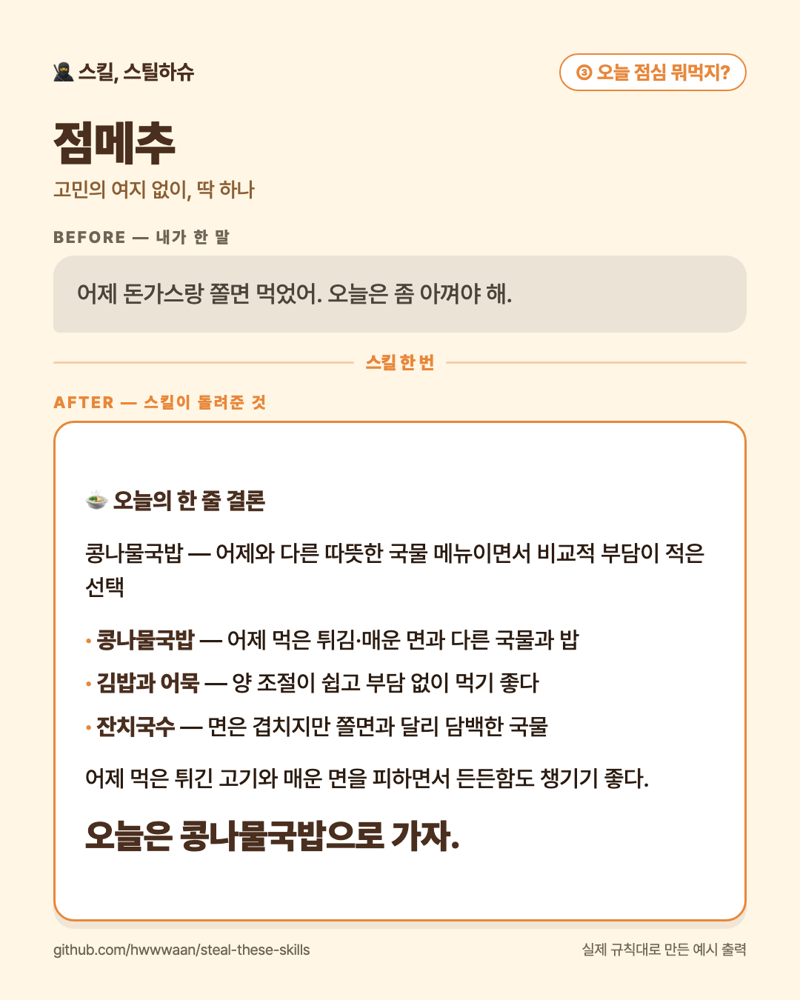

# 🍽️ ③ 오늘 점심 뭐먹지? — 점메추

**오늘 점심 메뉴를 하나로 골라주는 스킬**

최근에 먹은 음식과 오늘의 가격 부담을 반영해 후보 3개와 최종 메뉴 하나를 추천해요.

## 이렇게 말해보세요

- “어제 돈가스 먹었어. 오늘은 저렴하게 먹고 싶어.”
- “친구 3명이랑 먹을 건데 매운 건 빼고 골라줘.”
- “질문하지 말고 아무거나 하나 정해줘.”

## 쓰는 법

스킬 본문은 [`SKILL.md`](SKILL.md) 입니다. 설치는 [루트 README의 「쓰는 법」](../../README.md#쓰는-법)을 보세요.

---

만든 사람: **파도** · 슈크림마을 「스킬, 스틸하슈」
