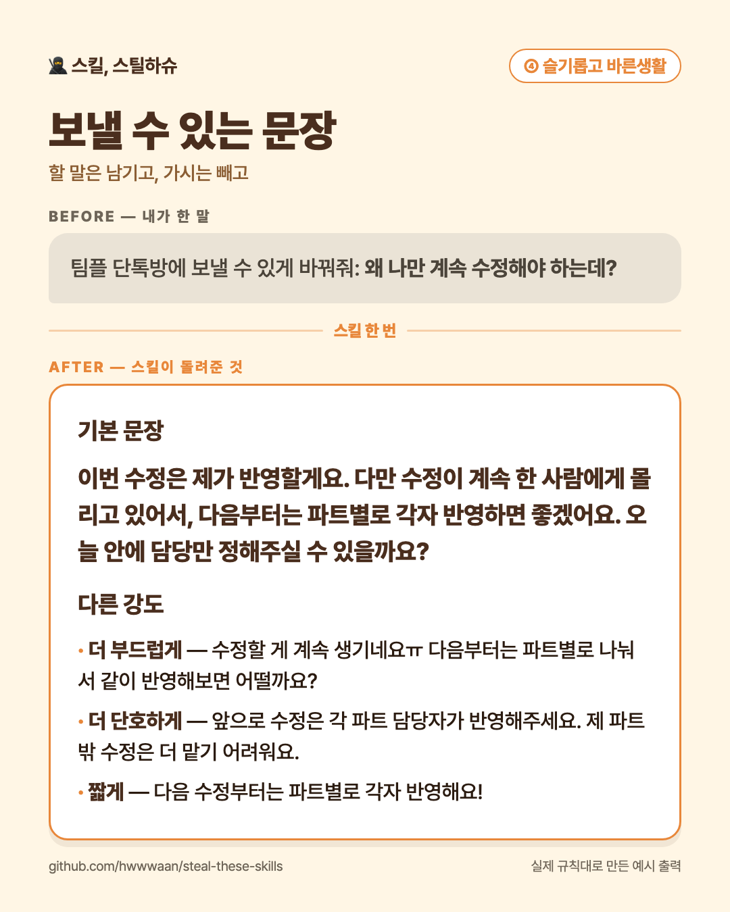

# 💬 ④ 슬기롭고 바른생활

**감정적인 말을 실제로 보낼 수 있는 문장으로 바꿔주는 스킬**

공격적인 표현은 줄이면서 필요한 요구, 거절과 경계는 분명하게 남겨요.

## 이렇게 말해보세요

- “팀플 단톡방에 보낼 수 있게 바꿔줘: 왜 나만 계속 수정해야 하는데?”
- “알바 대타 부탁을 정중하지만 단호하게 거절하는 말로 바꿔줘.”
- “내 말투는 유지하고 욕만 빼줘.”

## 쓰는 법

스킬 본문은 [`SKILL.md`](SKILL.md) 입니다. 설치는 [루트 README의 「쓰는 법」](../../README.md#쓰는-법)을 보세요.

---

만든 사람: **다운** · 슈크림마을 「스킬, 스틸하슈」
