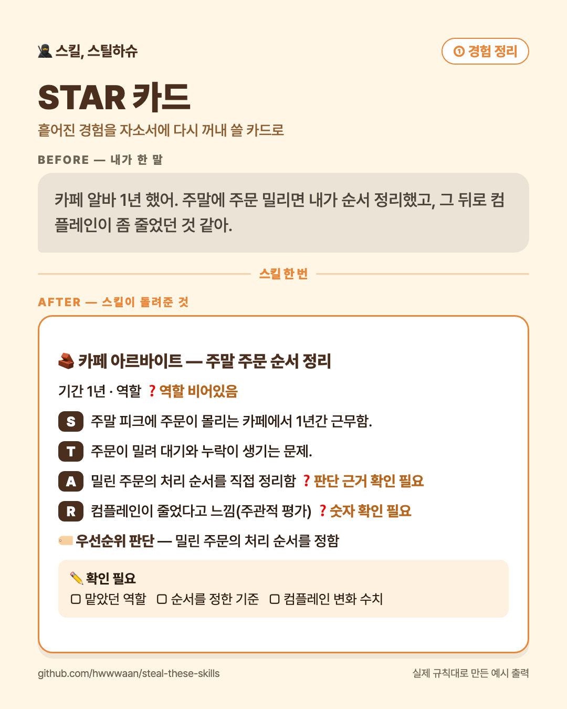

# 🧱 ① 경험 정리 — STAR 카드

**활동 경험을 다시 활용할 수 있는 STAR 카드로 정리하는 스킬**

동아리, 아르바이트, 조별과제, 대외활동과 인턴 경험을 사실 중심으로 구조화해요.

## 이렇게 말해보세요

- “카페 아르바이트 경험을 STAR로 정리해줘.”
- “조별과제에서 일정 관리를 맡았어. 경험 카드로 만들어줘.”
- “대외활동 경험 여러 개를 각각 분리해서 정리해줘.”

## 쓰는 법

스킬 본문은 [`SKILL.md`](SKILL.md) 입니다. 설치는 [루트 README의 「쓰는 법」](../../README.md#쓰는-법)을 보세요.

---

만든 사람: **파도** · 슈크림마을 「스킬, 스틸하슈」
